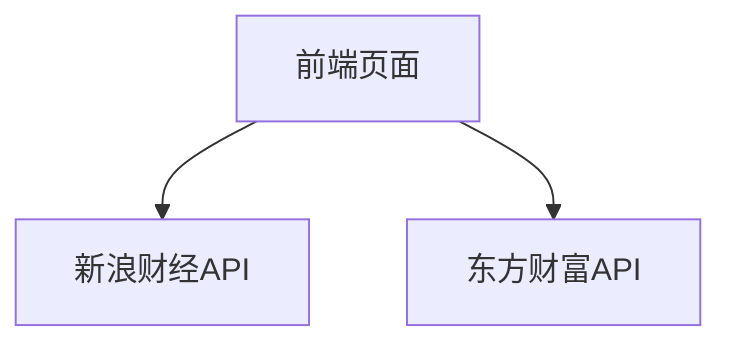

## 1. 架构设计

## 2. 技术说明
- 前端：纯HTML + CSS + JavaScript（无框架，轻量H5）
- 样式：TailwindCSS@3
- 图标：Lucide Icons
- 数据：新浪财经API（指数）+ 东方财富API（板块资金流向）

## 3. 路由定义
| 路由 | 用途 |
|------|------|
| / | 首页，展示指数和板块数据 |

## 4. API定义
### 4.1 新浪财经指数API（免费，无需认证）
- **接口地址**：`http://hq.sinajs.cn/list=指数代码`
- **支持指数**：
  - 上证指数: `s_sh000001`
  - 创业板指: `s_sz399006`
  - 科创50: `s_sh000688`
- **返回格式**：文本格式，字段用逗号分隔

### 4.2 东方财富板块资金流向API（免费，无需认证）
- **接口地址**：`https://push2.eastmoney.com/api/qt/clist/get`
- **参数说明**：
  - fid: 排序字段
  - fields: 返回字段
  - pn: 页码
  - pz: 每页条数

## 5. 数据模型
### 5.1 指数数据模型
| 字段名 | 类型 | 说明 |
|--------|------|------|
| name | string | 指数名称 |
| code | string | 指数代码 |
| price | number | 当前点位 |
| change | number | 涨跌额 |
| changePercent | number | 涨跌幅(%) |

### 5.2 板块数据模型
| 字段名 | 类型 | 说明 |
|--------|------|------|
| name | string | 板块名称 |
| money | number | 资金流入/流出金额(亿元) |
| changePercent | number | 涨跌幅(%) |

## 6. 更新机制
- 自动更新：每30秒刷新一次数据
- 手动更新：点击刷新按钮触发更新